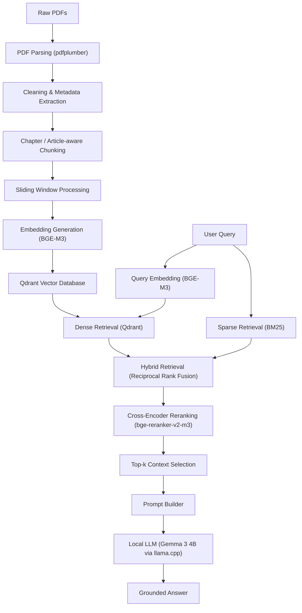

# ReguAZ

**AI-powered Regulatory Intelligence Platform for Azerbaijani banking compliance**

ReguAZ turns a fragmented corpus of publicly available Central Bank of Azerbaijan (CBA) regulatory documents — laws, CBAR rules, AML/KYC requirements, prudential and risk-management regulations, reporting/audit instructions, and governance standards — into a searchable, question-answerable knowledge base. It combines a hybrid retrieval pipeline (dense embeddings + BM25 + reciprocal rank fusion + cross-encoder reranking) with a local LLM generation stage, so that regulatory questions can be answered directly from source text — grounded, in Azerbaijani, with no hallucinated content. Built with Python, Qdrant, ChromaDB, sentence-transformers, and Hugging Face Transformers, and designed from the start as a production system rather than a proof of concept. The current implementation focuses exclusively on CBA-published regulatory documents; expanding to other regulated organizations is a long-term goal (see [Project Goals](#11-project-goals)).

---

## Table of Contents

1. [Project Overview](#1-project-overview)
2. [Features](#2-features)
3. [Architecture](#3-architecture)
4. [Project Structure](#4-project-structure)
5. [Technology Stack](#5-technology-stack)
6. [Installation](#6-installation)
7. [Configuration](#7-configuration)
8. [Running the Project](#8-running-the-project)
9. [Development Workflow](#9-development-workflow)
10. [Roadmap](#10-roadmap)
11. [Project Goals](#11-project-goals)
12. [License](#12-license)

---

## 1. Project Overview

### What it is

ReguAZ is a domain-specific RAG system built around 96 real regulatory documents publicly published by the Central Bank of Azerbaijan (CBA) — laws, CBAR rules, AML/KYC requirements, prudential and risk-management regulations, reporting/audit instructions, and governance standards. The current implementation is scoped exclusively to this CBA document set. The pipeline extracts these PDFs into clean text, chunks them in a chapter/article-aware way, embeds and indexes them, and evaluates multiple retrieval strategies against a hand-curated gold question set before an LLM generation stage produces an answer.

### Why it exists

Azerbaijani banking regulation published by the Central Bank is spread across dozens of laws, CBAR rules, and methodological guidance documents, most of which only exist as long, inconsistently formatted PDFs. Manually locating a specific requirement — minimum capital, AML thresholds, reporting deadlines — is slow and error-prone. ReguAZ makes this publicly available CBA corpus queryable in natural language, with answers grounded strictly in the retrieved regulatory text.

### Who it's for

Compliance officers, risk teams, auditors, and legal staff at Azerbaijani banks and financial institutions who need fast, traceable answers to regulatory questions — plus anyone building retrieval-augmented systems over dense, multi-language legal or regulatory text.

### The problem it solves

- Regulatory text is fragmented across many long PDFs with inconsistent formatting.
- Keyword search alone misses semantically related but lexically different phrasing.
- Pure semantic search alone can miss exact legal terms, article numbers, or defined terms.
- Domain experts need traceability back to the exact chunk, article, or page a claim came from.

ReguAZ addresses this with hybrid (semantic + keyword) retrieval, reranking, and a rigorously evaluated retrieval-quality process, before any answer is generated.

### Long-term vision

A production-ready regulatory intelligence assistant: a user asks a question in Azerbaijani, the system retrieves the most relevant passages via hybrid search and reranking, and a local LLM generates a concise, citation-grounded answer — explicitly refusing to answer when retrieved context is insufficient. Today the retrieval half of that pipeline is implemented and evaluated over the CBA document set, the generation half is implemented and independently verified, and the two are not yet wired into a single end-to-end script or API. Expanding beyond CBA documents to other regulated organizations is part of the longer-term direction — see [Project Goals](#11-project-goals).

---

## 2. Features

### Document Processing
- Regulatory document collection — 96 PDFs across 8 categories, all publicly published by the Central Bank of Azerbaijan (CBA).
- PDF extraction via `pdfplumber`, preserving page markers and stripping footers/page numbers.
- Text normalization (whitespace and blank-line cleanup).
- Chapter/article-aware chunking with a 4,000-character sliding window and 500-character overlap.
- Per-document metadata generation (page count, chunk count, language, parser, timestamp).
- Stable, human-readable chunk IDs (`{document_id}_{chapter/article}_{index}`).

### Embeddings
- Model-agnostic embedding pipeline with JSONL persistence.
- Four embedding models behind a common interface:
  - `intfloat/multilingual-e5-large` (asymmetric, query/passage prefixes)
  - `BAAI/bge-m3`
  - `jinaai/jina-embeddings-v3` (implemented; not yet wired into ingestion/evaluation)
  - `Qwen/Qwen3-Embedding-0.6B` (implemented; not yet wired into ingestion/evaluation)

### Vector Storage
- ChromaDB integration for local development and experimentation.
- Qdrant integration as the production backend, including deterministic UUID5 mapping from human-readable chunk IDs to Qdrant point IDs.

### Retrieval
- Dense (semantic) retrieval on both ChromaDB and Qdrant.
- BM25 keyword retrieval using a whitespace tokenizer suited to mixed Azerbaijani/Russian/English text.
- Hybrid retrieval via Reciprocal Rank Fusion, combining dense and sparse results.
- Cross-encoder reranking (`BAAI/bge-reranker-v2-m3`), currently applied in the Qdrant hybrid path.

### Evaluation
- Full retrieval evaluation framework: Recall@K, Precision@K, MRR@10, nDCG@K.
- 121-question hand-labeled gold evaluation dataset.
- Embedding model benchmarking (E5 vs. BGE-M3).
- Quantified, staged retrieval improvement:

| Pipeline | Recall@10 | MRR@10 |
|---|---|---|
| Plain dense — E5 | 0.140 | 0.107 |
| Plain dense — BGE-M3 | 0.368 | 0.280 |
| Hybrid (BM25 + RRF) — E5 | 0.364 | 0.212 |
| Hybrid (BM25 + RRF) — BGE-M3 | 0.360 | 0.270 |
| **Hybrid + Cross-Encoder rerank (Qdrant, BGE-M3)** | **0.897** | **0.765** |

*(See [Roadmap](#10-roadmap) for what these numbers mean for project direction.)*

### LLM Generation
- `BaseLLMProvider` — abstract, transport-agnostic provider interface.
- `LocalInferenceProvider` — in-process local inference backend.
- `PromptBuilder` — Azerbaijani-language system prompt enforcing context-only, non-hallucinated, formally worded answers.
- `Generator` — orchestrates question + context → prompt → provider → answer.
- `LLMProviderFactory` — single instantiation point; new providers (llama.cpp, remote, OpenAI-compatible) plug in without touching calling code.
- Lazy model loading, dependency injection, and automatic MPS / CUDA / CPU device selection.

---

## 3. Architecture

ReguAZ is organized as a layered pipeline rather than a monolithic application. Each stage reads the output of the previous stage from disk (JSONL/JSON/Markdown), which keeps stages independently re-runnable and testable.

```
Raw PDFs → Extraction → Chunking → Embedding → Vector Storage → Retrieval → Reranking → LLM Generation
```

### Pipeline flow



### Module responsibilities (`backend/reguaz/`)

| Module | Responsibility |
|---|---|
| `config.py` | Centralized paths and default constants (batch sizes, top-k, RRF constant, supported models). |
| `services/ingestion/` | Chunk lookup utilities used during vector-DB ingestion. |
| `services/chunks/` | Read-only chunk lookup utilities used during evaluation/BM25. |
| `services/embeddings/` | One class per embedding model behind a common `BaseEmbeddingService` interface, selected via `EmbeddingFactory`. |
| `database/` | Thin persistence managers for ChromaDB and Qdrant — collection lifecycle and batched inserts only, no retrieval logic. |
| `retrieval/` | Dense retrievers, `BM25Retriever`, RRF fusion, `CrossEncoderReranker`, and two orchestrating hybrid retrievers (Chroma and Qdrant + reranking). |
| `llm/` | Provider-agnostic LLM generation: `BaseLLMProvider`, `LocalInferenceProvider`, `LLMProviderFactory`, `PromptBuilder`, `Generator`. |
| `utils/logger.py` | Shared logger factory (console + rotating file handlers) used across all modules. |

`scripts/` contains the CLI entry points that drive each stage — extraction, chunking, embedding, ingestion, evaluation, LLM demo/verification — and act as the operational interface to the `backend/reguaz` library code.

---

## 4. Project Structure

```
banking-regulatory-intelligence-platform/
│
├── backend/reguaz/         # Core library: config, database, llm, retrieval, services, utils
├── backend/tests/          # Placeholder — no tests implemented yet
│
├── scripts/                # CLI entry points for each pipeline stage
│                            # (extraction, chunking, embedding, ingestion, evaluation, LLM demo)
│
├── data/
│   ├── raw/                 # 96 source PDFs across 8 regulatory categories
│   ├── processed/           # Cleaned documents, chunks, metadata, embeddings
│   ├── chroma/               # ChromaDB persisted vector store (contents gitignored)
│   └── evaluation/           # Gold datasets for retrieval and LLM-generation evaluation
│
├── docs/                    # Architecture notes and planning docs (mostly placeholders today)
├── logs/                    # Root-level pipeline logs
├── results/                  # Evaluation outputs — metrics, per-question results, comparisons
├── docker-compose.yml         # Present, currently empty
├── pyproject.toml / poetry.lock  # Poetry project definition
└── README.md
```

**Notes:**
- `data/raw/` spans 8 categories: `laws`, `aml_kyc`, `governance_and_compliance`, `guidance_and_methodology`, `payments_and_banking_operations`, `prudential_regulations`, `reporting_and_audit`, `risk_management`.
- `data/chroma/` and `data/qdrant/` hold persisted vector-index files; only their structure is versioned, not their contents.
- `docs/folder_structure.md` sketches an aspirational, FastAPI-based application layer that doesn't exist in the codebase yet — treat it as a roadmap note, not current architecture.

---

## 5. Technology Stack

| Category | Technology |
|---|---|
| Language | Python (3.12 – 3.14) |
| Dependency management | Poetry |
| PDF extraction | pdfplumber |
| Embeddings | sentence-transformers (E5, BGE-M3, Jina v3, Qwen3) |
| Vector databases | ChromaDB, Qdrant |
| Keyword search | rank-bm25 |
| Reranking | sentence-transformers `CrossEncoder` (BGE-reranker-v2-m3) |
| LLM inference | Hugging Face Transformers, PyTorch, Accelerate, llama.cpp (in progress) |
| Data handling | pandas, openpyxl |
| Backend | FastAPI |
| Frontend | React |
| Development tools | Poetry, pytest (planned) |

---

## 6. Installation

### Prerequisites
- Python 3.12 (project requires `>=3.12,<3.15`)
- Poetry for dependency management
- (Optional) a Hugging Face token, recommended if you configure gated or private models

### Clone the repository
```bash
git clone https://github.com/KamalMusayev/banking-regulatory-intelligence-platform.git
cd banking-regulatory-intelligence-platform
```

### Install Poetry
```bash
curl -sSL https://install.python-poetry.org | python3 -
poetry --version
```

### Install dependencies
```bash
poetry env use python3.12
poetry install
poetry shell   # or: poetry env activate
```

This installs everything declared in `pyproject.toml` / `poetry.lock`, including `torch`, `chromadb`, `qdrant-client`, `sentence-transformers`, and `pdfplumber`.

### Configure environment
```bash
cp .env.example .env
# Edit .env and add only the provider keys you intend to use.
# Never commit .env.
```

`OPENROUTER_API_KEY` is required only for the optional answer-audio button. Keep
it in the root `.env`; it is never sent to the browser.

### Download the model
Local inference models are downloaded automatically on first use via Hugging Face Transformers. To pre-fetch:
```bash
python scripts/verify_llm_module.py
```

### Run the complete development application
```bash
./scripts/start_dev.sh
```

This starts the FastAPI backend at `http://127.0.0.1:8000` and the Vite frontend
at `http://127.0.0.1:3000`. Press `Ctrl+C` once to stop both processes. The
scripts resolve the repository root from their own location, so they do not
contain machine-specific paths.

To run the services in separate terminals:

```bash
./scripts/start_backend.sh
./scripts/start_frontend.sh
```

Optional port overrides are supported without editing source files:

```bash
BACKEND_PORT=8010 FRONTEND_PORT=3010 ./scripts/start_dev.sh
```

### Verify the installation
```bash
python --version        # Expect: Python 3.12.x
poetry show              # Lists installed packages
python scripts/verify_llm_module.py   # Smoke-tests the LLM module imports and abstract-class behavior
```

---

## 7. Configuration

Application settings are loaded from environment variables and the ignored
repository-root `.env`. Relevant optional secrets include:

| Variable | Purpose |
|---|---|
| `HF_TOKEN` | Authenticates Hugging Face downloads for gated or private models. |
| `GROQ_API_KEY` | Enables the configured Groq generation providers. |
| `NVIDIA_API_KEY` | Enables the NVIDIA generation provider. |
| `OPENROUTER_API_KEY` | Enables on-demand Fish Audio answer speech. |

Non-secret defaults are documented in `.env.example`. TTS-specific operational
and privacy details are in [docs/tts.md](docs/tts.md).

---

## 8. Running the Project

All commands assume an activated Poetry environment at the project root.

### Document processing
```bash
python scripts/extract_pdfs.py   # Stage 1 — PDFs → cleaned Markdown
python scripts/chunker.py        # Stage 2 — Markdown → chunks + metadata
```

### Embedding generation
```bash
python scripts/run_embedding_pipeline.py --model bge_m3
python scripts/run_embedding_pipeline.py --model e5
```

### Vector-store ingestion
```bash
python scripts/run_chroma_ingestion.py                       # ChromaDB
python scripts/run_qdrant_ingestion.py --batch-size 256       # Qdrant (production path)
```

### Retrieval evaluation
```bash
python scripts/run_retrieval_evaluation.py --top-k 10 --chroma-dir data/chroma
python scripts/run_hybrid_evaluation.py --model all --top-k 10 --chroma-dir data/chroma
python scripts/run_hybrid_qdrant_evaluation.py --top-k 10 --qdrant-dir data/qdrant
```

Each evaluation script writes `metrics.json`, `per_question.csv`, `retrieval_results.csv`, and a cross-run `comparison.csv` under `results/`.

### LLM verification and demo
```bash
python scripts/verify_llm_module.py   # Imports, abstract-class enforcement, wiring
python scripts/run_llm_demo.py        # Full Prompt → LLM → Answer pipeline on a sample question
```

### Candidate export (gold-dataset curation helper)
```bash
python scripts/export_candidates.py
```
Retrieves top-10 ChromaDB (E5) candidates per gold-dataset question, written to `data/evaluation/chunk_candidates.json` for manual gold-set curation.

---

## 9. Development Workflow

**Branching** — branch from `main` with a descriptive prefix, e.g. `feature/hybrid-qdrant-rerank`, `fix/chunker-empty-pages`, `docs/readme-rewrite`. Keep branches scoped to a single pipeline stage where possible.

**Commits** — imperative, present-tense messages (`Add Cross-Encoder reranking to Qdrant hybrid retriever`, not `Added...`). Prefer small, reviewable commits, since each stage can be tested independently against its on-disk inputs/outputs.

**Pull Requests** — describe which pipeline stage(s) the PR touches and how it was validated (e.g. "re-ran `run_hybrid_qdrant_evaluation.py`, recall@10 unchanged at 0.897"). There's currently no automated test suite, so include the manual verification steps taken.

**Poetry workflow**
```bash
poetry show
poetry add <package>
poetry remove <package>
poetry lock
poetry install
```

---

## 10. Roadmap

| Milestone | Status | Description |
|---|---|---|
| Regulatory document collection | ✅ Done | 96 PDFs collected and organized across 8 categories. |
| PDF extraction | ✅ Done | pdfplumber-based parsing, cleaning, and preprocessing. |
| Metadata generation | ✅ Done | Per-document metadata (pages, chunk counts, language, timestamps). |
| Intelligent chunking | ✅ Done | Chapter/article-aware chunking with hierarchical chunk IDs. |
| Sliding-window chunking | ✅ Done | 4,000-char window with 500-char overlap. |
| Embedding infrastructure | ✅ Done | Modular writer/reader pipeline with JSONL persistence. |
| Embedding model abstraction | ✅ Done | Common interface across four embedding models. |
| BGE-M3 integration | ✅ Done | Primary production embedding model. |
| Qdrant integration | ✅ Done | Production vector database, deterministic ID mapping. |
| ChromaDB integration | ✅ Done | Local development / experimentation vector store. |
| BM25 retrieval | ✅ Done | Lexical retrieval for mixed-language text. |
| Hybrid retrieval | ✅ Done | Dense + sparse combination. |
| Reciprocal Rank Fusion | ✅ Done | Fusion logic for hybrid retrieval. |
| Cross-Encoder reranking | ✅ Done | BGE-reranker-v2-m3 applied on the Qdrant hybrid path. |
| Retrieval evaluation framework | ✅ Done | Recall@K, Precision@K, MRR@10, nDCG@K. |
| Evaluation datasets and metrics | ✅ Done | 121-question hand-labeled gold set. |
| Prompt Builder | ✅ Done | Azerbaijani, context-only system prompt. |
| LLM provider abstraction | ✅ Done | `BaseLLMProvider`, `LLMProviderFactory`, dependency injection. |
| Multi-device support | ✅ Done | Automatic MPS / CUDA / CPU detection. |
| Backend implementation (FastAPI) | ✅ Done | Core service layer implemented. |
| Frontend implementation (React) | ✅ Done | Core frontend implemented. |
| Configuration system | ✅ Done | Centralized paths and constants. |
| CLI pipeline scripts | ✅ Done | One script per pipeline stage. |
| Logging and project infrastructure | ✅ Done | Shared logger factory, rotating file handlers. |
| Local LLM integration (Gemma 3 4B via llama.cpp) | 🟡 In Progress | Currently being finalized and validated. |
| End-to-end RAG generation pipeline | ⬜ Planned | Wire retrieval directly into LLM generation as one workflow. |
| Conversation memory | ⬜ Planned | Multi-turn context handling. |
| Performance optimization | ⬜ Planned | Latency and throughput tuning across the pipeline. |
| Docker deployment | ⬜ Planned | Containerized deployment. |
| CI/CD | ⬜ Planned | Automated testing and deployment pipeline. |
| Production deployment | ⬜ Planned | Monitoring, infrastructure, and go-live readiness. |

Most of the platform is already built and evaluated; what remains is finalizing local LLM inference and productionizing the system end to end.

---

## 11. Project Goals

ReguAZ's near-term goal is to become a production-ready regulatory intelligence assistant for Central Bank of Azerbaijan (CBA) regulations — one that compliance teams can query directly in natural language and trust to answer only from verified CBA regulatory text, with clear traceability to the source article or page. The retrieval layer has already been benchmarked and optimized to a high standard (Recall@10 of 0.897 with hybrid retrieval and reranking); the next phase focuses on connecting that retrieval quality to a reliable, low-latency local LLM generation stage, and then hardening the whole pipeline for real deployment — via a stable API, containerized infrastructure, and continuous evaluation of generated answers for groundedness and correctness.

Longer term, and **not yet implemented**, the vision is to extend this same architecture beyond the Central Bank to build dedicated Regulatory Intelligence platforms for other regulated organizations, including:

- commercial banks,
- insurance companies,
- payment providers,
- fintech companies,
- and other regulated organizations.

Each organization would eventually have its own dedicated RAG system, built on its own regulatory documents, internal policies, and knowledge base, following the same ingestion → retrieval → generation architecture proven here on CBA regulations. This expansion is a future direction for the project, not a current capability.

---

## 12. License

This project is licensed under the MIT License.
# ReguAz

## V2 structure-aware chunking

The isolated V2 Markdown chunking and metadata pipeline is documented in [docs/chunking_v2.md](docs/chunking_v2.md). Run it from the repository root with:

```bash
poetry run python scripts/run_chunking_v2.py --dry-run
poetry run python scripts/run_chunking_v2.py
```

The next isolated stage generates BGE-M3 dense+sparse child embeddings and ingests them into a versioned Qdrant collection. See [docs/embedding_qdrant_v2.md](docs/embedding_qdrant_v2.md).

### Rebuild the local V2 Qdrant collection after cloning

V2 embedding shards and embedded Qdrant storage are generated artifacts and are not committed to Git. From the repository root, install the locked dependencies, generate the embeddings, validate the ingestion plan, and then create the local collection:

```bash
poetry install
poetry run python scripts/run_embedding_v2.py --device cpu
poetry run python scripts/run_qdrant_ingestion_v2.py --dry-run
poetry run python scripts/run_qdrant_ingestion_v2.py
```

The final command creates a versioned physical collection under `data/processed/v2/qdrant`, validates its dense and sparse vectors and point count, then sets the local `reguaz_v2_current` alias. It does not modify V1. On a CUDA workstation, embedding generation may use `--device cuda:0 --fp16`; `--device cpu` is the portable fallback. Do not run the backend or another local Qdrant client during ingestion because embedded Qdrant permits only one process to hold the storage lock.

The read-only V2 retrieval stage combines lean named dense and learned-sparse Qdrant search with child-only BM25, equal-weight RRF, top-15 hydration, BGE reranking, final-five payload fetch, and post-rerank parent resolution. Its frozen 50-question source-first evaluation dataset and baseline/optimized commands are documented in [docs/retrieval_v2.md](docs/retrieval_v2.md).

The V2 generation path adds depth-one relation expansion, evidence budgeting, structured local Gemma output, backend-resolved citations, and exact cleaned-Markdown highlighting. See [docs/generation_v2.md](docs/generation_v2.md).

V2 chat can select local Gemma, Groq GPT-OSS 20B, or Groq GPT-OSS 120B per request. Remote models use strict JSON Schema output; citation metadata remains backend-resolved from immutable V2 artifacts. Provider setup and the consent-gated dev benchmark are documented in [docs/generation_v2.md](docs/generation_v2.md).

Final assistant answers also support optional, on-demand OpenRouter/Fish Audio text-to-speech. The small speaker control does not delay retrieval or generation, and audio is not persisted. Configuration, security rules and the fixed Azerbaijani smoke suite are documented in [docs/tts.md](docs/tts.md).
